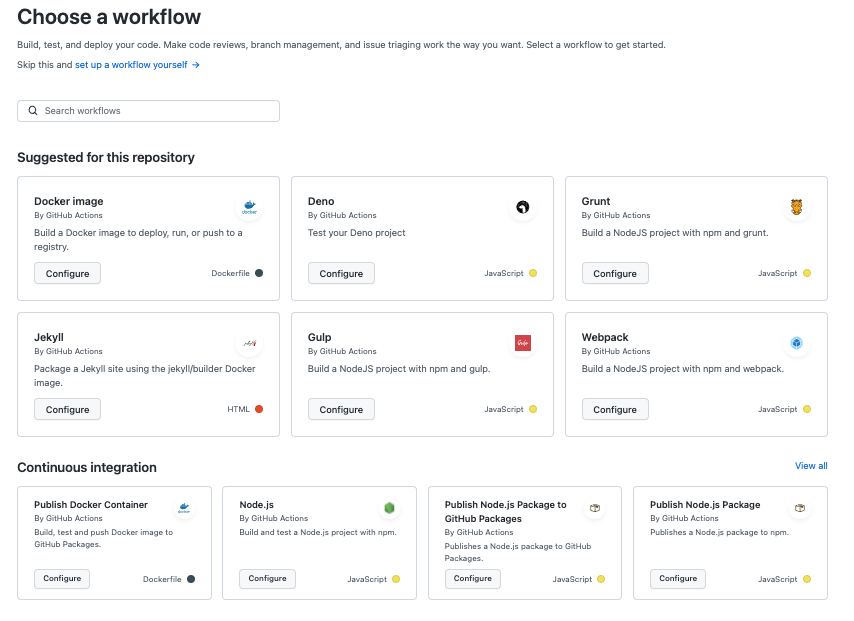
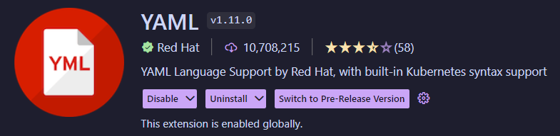

# **CI/CD and Github Actions**

Ong Hin Journ


---

## Table of Contents

1. What is CI/CD and Github Actions
2. Why create a CI/CD pipeline with Github Actions
3. Creating a basic CI/CD pipeline with Github Actions
4. Common Mistakes

---

<!-- _class: lead invert -->

## What is CI/CD and GitHub Actions

---

<!-- Continuous Integration is the automation process of building, testing, and merging code changes of an app to a shared repository. -->

<!-- Continuous Delivery ensures that it takes little effort to deploy new code that has been automatically tested and uploaded to the repository. -->

<!-- Continuous Deployment is similar to Continuous Delivery, but instead of deploy new code, it releases changes from repository to production.

This new release is usable by customers. -->

## What is CI/CD

- "CI" stands for "Continuous Integration"
- The "CD" stands for "Continuous Delivery" and/or "Continuous Deployment"

---

<!-- GitHub provides Linux, Windows, and macOS virtual machines to run your workflows, or you can host your own self-hosted runners in your own data center or cloud infrastructure. -->

## What is Github Actions

- GitHub Actions is a CI/CD platform for GitHub
- It allows for automation of builds, tests, and deployment pipelines

---

## Why create a CI/CD pipeline with GitHub Actions

- GitHub Actions automates most of the manual processes like tests
- GitHub Actions performs the actions much faster than doing it manually

---

<!-- _class: lead invert -->

<!-- This workflow will be a basic workflow testing the build of the application on every pull request made to main branch -->

## Creating a basic CI/CD pipeline with Github Actions

---

<!-- This example will be from my Bloggers app -->

## Prerequisites

- A GitHub Repository owned by you

---

## Choosing a workflow

- To choose a workflow, head to the `Actions` tab of your repository
- Under `Continuous integration`, select `Node.js` and configure it



---

<!-- I modified the workflow to suit it like this etc etc.
Sometimes people using pnpm instead of npm etc. -->

## Modifying the workflow

```yaml
# This workflow will do a clean installation of node dependencies, cache/restore them, build the source code and run tests across different versions of node
# For more information see: https://docs.github.com/en/actions/automating-builds-and-tests/building-and-testing-nodejs

name: Node.js CI

on:
  pull_request:
    branches: ["main"]

jobs:
  build:
    runs-on: ubuntu-latest

    strategy:
      matrix:
        node-version: [14.x, 16.x, 18.x]
        # See supported Node.js release schedule at https://nodejs.org/en/about/releases/

    steps:
      - uses: actions/checkout@v3
      - name: Use Node.js ${{ matrix.node-version }}
        uses: actions/setup-node@v3
        with:
          node-version: ${{ matrix.node-version }}
          cache: "npm"
      - run: npm ci
      - run: npm run build --if-present
      - run: npm test
```

---

<!-- _class: lead invert -->

## Common Mistakes

---

## Linting

- Syntax might be foreign, mistakes can happen
- To prevent this, a linter can be installed



---

## GitHub Secrets

- API keys, tokens, or passwords should never be stored plaintext
- Instead use GitHub Secrets
- Something like environment variables

---

## References/Resources

- What is Ci/CD and how does it work? (no date) Synopsys. Synopsys. Available at: [https://www.synopsys.com/glossary/what-is-cicd.html](https://www.synopsys.com/glossary/what-is-cicd.html) (Accessed: January 25, 2023).
- What is CI/CD? (2022) What is CI/CD VB. Red Hat. Available at: [https://www.redhat.com/en/topics/devops/what-is-ci-cd](https://www.redhat.com/en/topics/devops/what-is-ci-cd) (Accessed: January 25, 2023).
- Douglas, B. (2022) How to build a CI/CD pipeline with github actions in four simple steps, The GitHub Blog. GitHub. Available at: [https://github.blog/2022-02-02-build-ci-cd-pipeline-github-actions-four-steps/](https://github.blog/2022-02-02-build-ci-cd-pipeline-github-actions-four-steps/) (Accessed: January 25, 2023).

---

- Segura, T. (2022) GitHub actions security best practices [cheat sheet included], GitGuardian Blog - Automated Secrets Detection. GitGuardian. Available at: [https://blog.gitguardian.com/github-actions-security-cheat-sheet/](https://blog.gitguardian.com/github-actions-security-cheat-sheet/) (Accessed: January 25, 2023).
